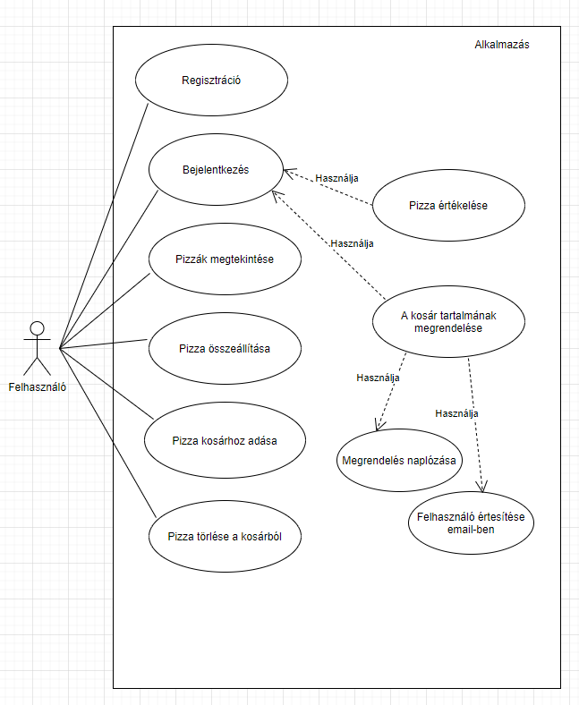
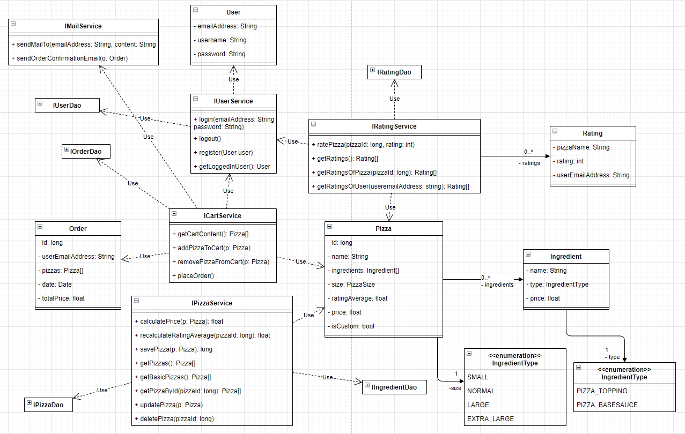
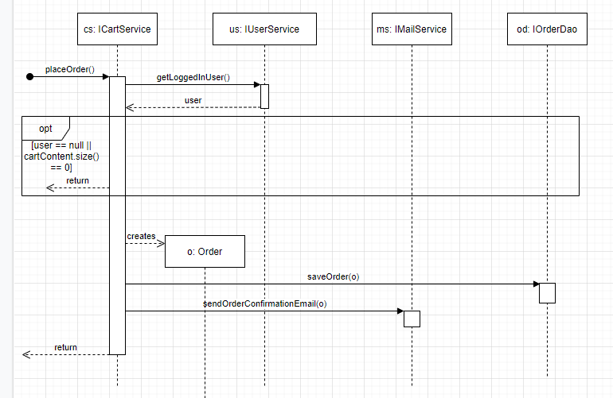

# PizzaApp

## Telepítés

Az alkalmazás oracle adatbázist használ az adatok mentéséhez. Ahhoz, hogy tudd használni az
alkalmazást futtatnod kell egy oracle adatbázist, aminek a csatlakozási adatait meg kell adnod az
application.yml és liquibase.properties fájlban.

A megrendelést megerősítő email küldésére az alkalmazás a gmail smtp szerverét használja. Ehhez a funkcióhoz
meg kell adni egy gmail fiók belépési adatait, ami a levelek feladójaként fog szolgálni. Ehhez hozz létre egy
emailsender.txt nevű fájlt a src/main/resources mappában, aminek első sora legyen a fiók email cím és a második
sora pedig a fiók jelszó. Tesztelés céljából be lehet állítani, hogy az email a feladónak legyen elküldve. Ezt
az application.yml fájlban lehet beállítani az alábbi kódrészlet hozzáadásával / módosításával:

    pizzaApp:
        email:
            sendToSelf: true

Lehetséges értékek:  
- true: a levél a feladónak lesz elküldve.  
- false: a levél annak a felhasználónak lesz elküldve, aki a pizzát megrendelte.

## Üzleti igény

### Specifikáció

Az alkalmazással pizzákat lehet megrendelni. Az ajánlatok oldalon válogathatunk a listából
a pizzák közül vagy akár saját pizzát is összerakhatunk egy másik oldalon. 

A pizzák hozzáadhatóak és törölhetőek a kosárból. Ha meg szeretnénk rendelni a pizzákat, 
a kosárra kattintva megrendelhetjük a kosár tartalmát. 
A megrendelés véglegesítésekor email értesítést kapunk a megrendelésről, 
ami tartalmazza a megrendelés információit és a megrendelés naplózásra kerül. Egyszerre legfeljebb
15 pizza lehet a kosárban.

Pizzákat rendelni csak bejelentkezett felhasználók tudnak. Ha bejelentkezés nélkül rendelünk, akkor
át leszünk irányítva a bejelentkezés oldalra, ahol be tudunk jelentkezni vagy át tudunk ugrani a
regisztráció oldalra. A pizzákat megtekinthetjük, hozzáadhatjuk / törölhetjük a kosárból
és készíthetünk saját pizzát is bejelentkezés nélkül is.

A bejelentkezett felhasználók tudják értékelni azokat a pizzákat, amikat egyszer már megrendeltek.
A pizzák mellett látszik, hogy hányan értékelték és az értékelések átlaga.

Lehet saját pizzát készíteni a megadott alapanyagok kiválasztásával. A feltétek szabadon 
kombinálhatóak, viszont 1 pizzán legfeljebb 5 feltét szerepelhet. Pizza alapból csak 1 
válaszható, tehát például nem lehet a pizza egyszerre tejfölös és paradicsomszószos alapú. 
Az elkészített pizzát hozzá lehet adni a kosárhoz és meg lehet rendelni.

### Követelmények

ID | Leírás
---|-------
01 | Egy listában meg lehet tekinteni a pizzákat.
02 | A pizzát hozzá lehet adni a kosárhoz.
03 | A pizzát törölni lehet a kosárból.
04 | A kosárra kattintva meg lehet rendelni a tartalmát.
05 | Ha sikeresen megtörtént a rendelés email értesítést kap a megrendelő.
06 | Ha sikeresen megtörtént a rendelés, a megrendelés naplózásra kerül.
07 | A kosárban legalább 0 és legfeljebb 15 pizza lehet.
08 | Pizzát csak regisztrált felhasználók tudnak rendelni.
09 | Ha a felhasználó nincs bejelentkezve és úgy próbál meg pizzát rendelni, akkor a bejelentkezés oldalra lesz irányítva és a rendelés nem történik meg.
10 | A pizzákat meg lehet tekinteni, hozzá lehet adni / törölni a kosárból és saját pizza is készíthető bejelentkezés nélkül.
11 | A pizzákat lehet értékelni.
12 | Csak a bejelentkezett felhasználók tudnak pizzát értékelni.
13 | Csak azt a pizzát tudja egy felhasználó értékelni, amit egyszer már sikeresen megrendelt.
14 | A pizzák értékelése 1-5-ös skálán történik.
15 | A pizzák listázásánál látszik, hogy hányan értékelték.
16 | A pizzák listázásánál látszik az értékelések átlaga.
17 | Egy pizzán az értékelések számát és átlagát a kijelentkezett felhasználók is látják.
18 | Lehet saját pizzát összeállítani.
19 | Egy pizzán legfeljebb 5 feltét szerepelhet és legalább 1.
20 | A pizzának csak 1 alapot lehet megadni (tejföl vagy paradicsomszósz vagy ....).
21 | Az összerakott pizzát hozzá lehet adni a kosárhoz.
22 | Az összerakott pizzát törölni lehet a kosárból.
23 | Az összerakott pizzát meg lehet rendelni a kosáron keresztül.
24 | A felhasználó tud regisztrálni.
25 | A felhasználó be tud lépni a regisztrált fiókjával.
26 | A felhasználó ki tud lépni, ha be van jelentkezve.

## Terv

### Use-case diagram

### Osztály diagram

### Szekvencia diagram

#### Megrendelés leadása
